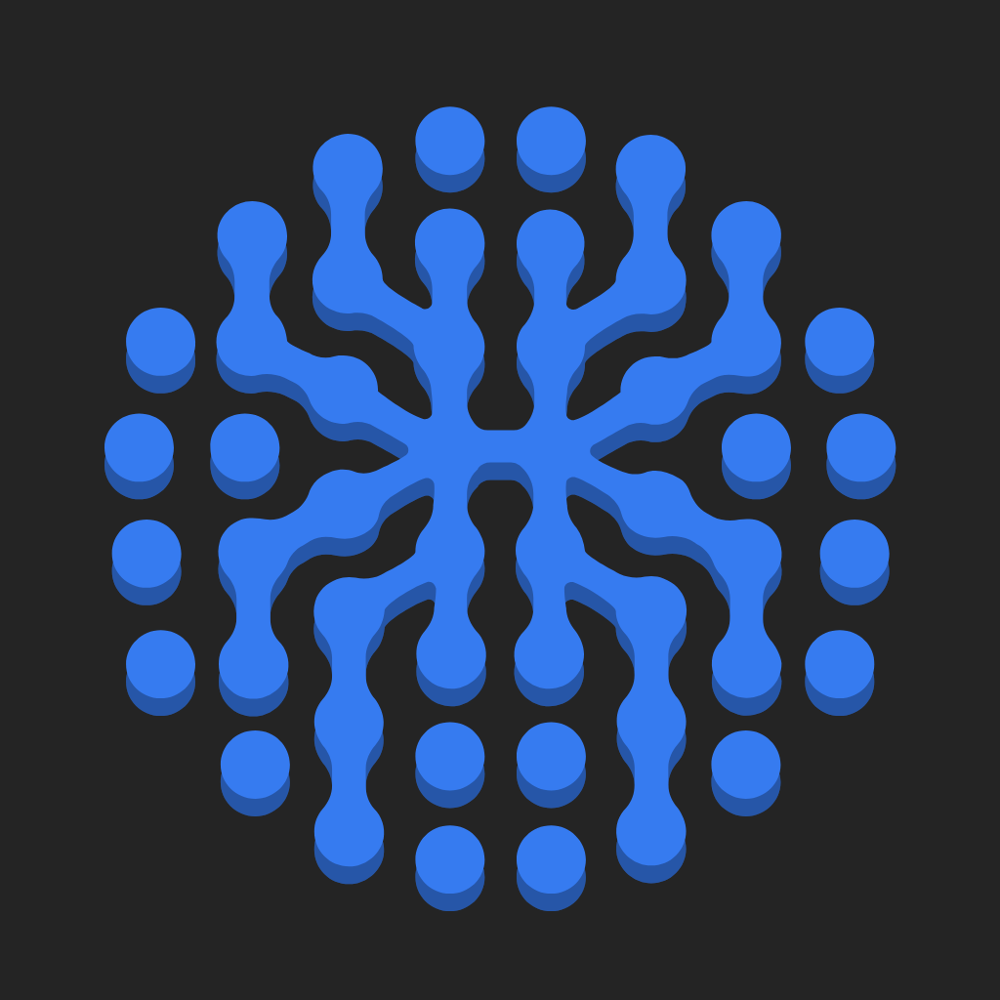
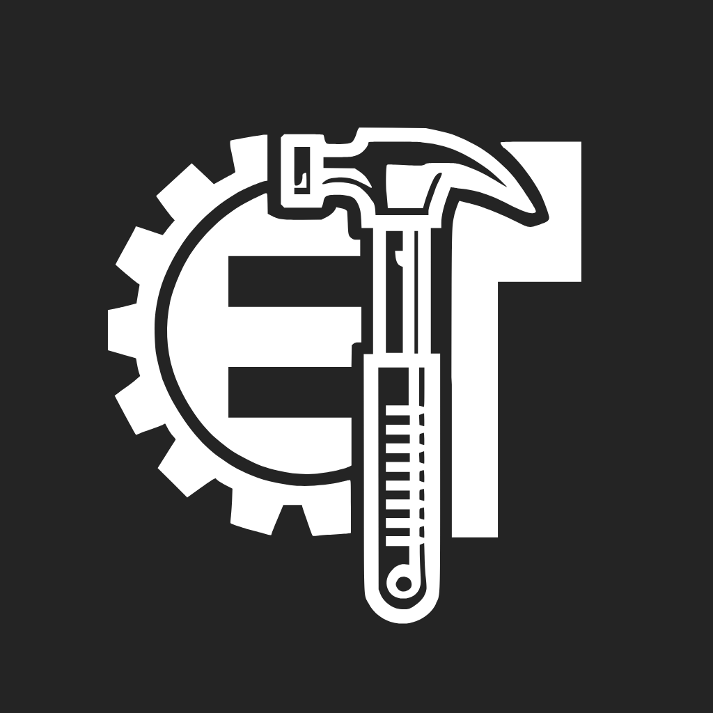

 
  
Visitor count

 
 
 <h1 align="center">
  
</h1>
A human-risk–focused social engineer specializing in behavioral manipulation analysis, OSINT investigations, and human-centered cybersecurity awareness.
 

 
- 🌱 I’m currently learning **[System Design](https://blog.bytebytego.com/p/free-system-design-pdf-158-pages)**
 
- 💬 Ask me about **Java, Node.js, React...or anything [here](https://github.com/{USERNAME}/{USERNAME}/issues)**

  

  
  
  
  

🛠️ Languages and Tools
 

  

  
   
    
      
       
        

<!--
**RymKhelili/RymKhelili** is a ✨ _special_ ✨ repository because its `README.md` (this file) appears on your GitHub profile.

Here are some ideas to get you started:

- 🔭 I’m currently working on ...
- 🌱 I’m currently learning ...
- 👯 I’m looking to collaborate on ...
- 🤔 I’m looking for help with ...
- 💬 Ask me about ...
- 📫 How to reach me: ...
- 😄 Pronouns: ...
- ⚡ Fun fact: ...
-->
